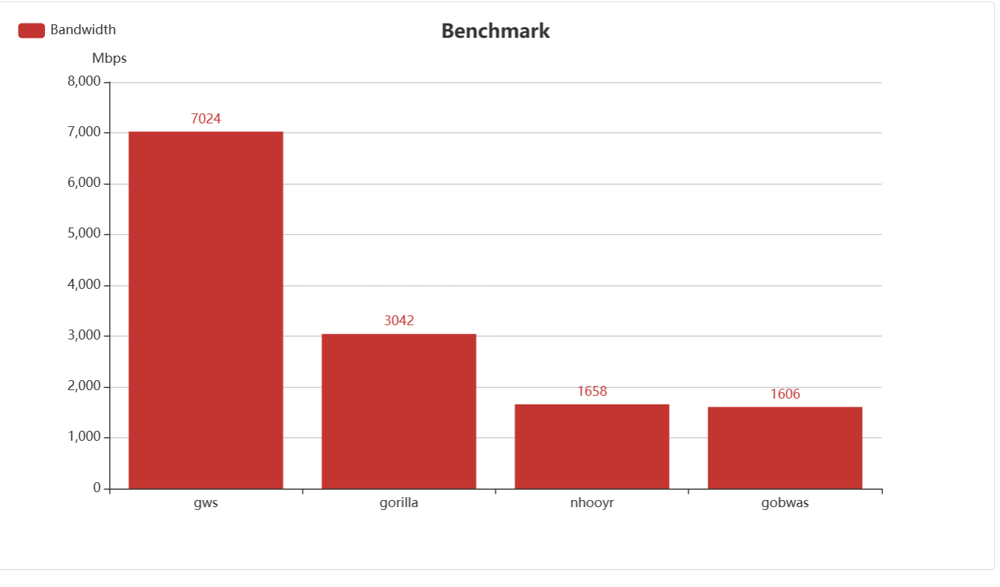
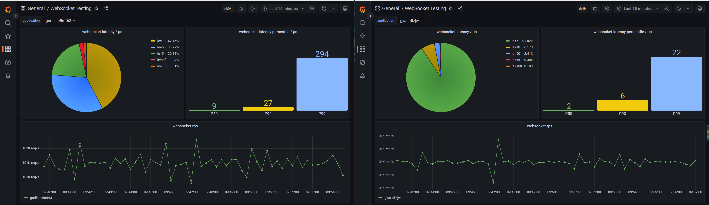

# gws

### event-driven go websocket server

[![Build Status][1]][2] [![MIT licensed][3]][4] [![Go Version][5]][6] [![codecov][7]][8] [![Go Report Card][9]][10]

[1]: https://github.com/lxzan/gws/workflows/Go%20Test/badge.svg?branch=master

[2]: https://github.com/lxzan/gws/actions?query=branch%3Amaster

[3]: https://img.shields.io/badge/license-MIT-blue.svg

[4]: LICENSE

[5]: https://img.shields.io/badge/go-%3E%3D1.16-30dff3?style=flat-square&logo=go

[6]: https://github.com/lxzan/gws

[7]: https://codecov.io/github/lxzan/gws/branch/master/graph/badge.svg?token=DJU7YXWN05

[8]: https://app.codecov.io/gh/lxzan/gws

[9]: https://goreportcard.com/badge/github.com/lxzan/gws

[10]: https://goreportcard.com/report/github.com/lxzan/gws

- [gws](#gws)
	- [Highlight](#highlight)
	- [Install](#install)
	- [Event](#event)
	- [Quick Start](#quick-start)
	- [Best Practice](#best-practice)
	- [Usage](#usage)
		- [Upgrade from HTTP](#upgrade-from-http)
		- [Client](#client)
		- [Broadcast](#broadcast)
	- [Autobahn Test](#autobahn-test)
	- [Benchmark](#benchmark)
	- [Acknowledgments](#acknowledgments)

### Highlight

- No dependency
- IO multiplexing support, concurrent message processing and asynchronous non-blocking message writing
- High IOPS and low latency, low CPU usage
- Support fast parsing WebSocket protocol directly from TCP, faster handshake, 30% lower memory usage
- Fully passes the WebSocket [autobahn-testsuite](https://lxzan.github.io/gws/reports/servers/)

### Install

```bash
go get -v github.com/lxzan/gws@latest
```

### Event

```go
type Event interface {
	OnOpen(socket *Conn)
	OnError(socket *Conn, err error)
	OnClose(socket *Conn, code uint16, reason []byte)
	OnPing(socket *Conn, payload []byte)
	OnPong(socket *Conn, payload []byte)
	OnMessage(socket *Conn, message *Message)
}
```

### Quick Start

```go
package main

import "github.com/lxzan/gws"

func main() {
	gws.NewServer(new(gws.BuiltinEventHandler), nil).Run(":6666")
}
```

### Best Practice
```go
package main

import (
	"github.com/lxzan/gws"
	"time"
)

const PingInterval = 10 * time.Second

func main() {
	options := &gws.ServerOption{ReadAsyncEnabled: true, ReadAsyncGoLimit: 4}
	gws.NewServer(new(Handler), options).Run(":6666") 
}

type Handler struct{}

func (c *Handler) OnOpen(socket *gws.Conn) { _ = socket.SetDeadline(time.Now().Add(3 * PingInterval)) }

func (c *Handler) DeleteSession(socket *gws.Conn) {}

func (c *Handler) OnError(socket *gws.Conn, err error) { c.DeleteSession(socket) }

func (c *Handler) OnClose(socket *gws.Conn, code uint16, reason []byte) { c.DeleteSession(socket) }

func (c *Handler) OnPing(socket *gws.Conn, payload []byte) {
	_ = socket.SetDeadline(time.Now().Add(3 * PingInterval))
	_ = socket.WritePong(nil)
}

func (c *Handler) OnPong(socket *gws.Conn, payload []byte) {}

func (c *Handler) OnMessage(socket *gws.Conn, message *gws.Message) {}
```


### Usage

#### Upgrade from HTTP

```go
package main

import (
	"github.com/lxzan/gws"
	"log"
	"net/http"
)

func main() {
	upgrader := gws.NewUpgrader(new(gws.BuiltinEventHandler), &gws.ServerOption{
		CheckOrigin: func(r *http.Request, session gws.SessionStorage) bool {
			session.Store("username", r.URL.Query().Get("username"))
			return true
		},
	})

	http.HandleFunc("/connect", func(writer http.ResponseWriter, request *http.Request) {
		socket, err := upgrader.Upgrade(writer, request)
		if err != nil {
			log.Printf(err.Error())
			return
		}
		socket.ReadLoop()
	})

	if err := http.ListenAndServe(":6666", nil); err != nil {
		log.Fatalf("%v", err)
	}
}
```

#### Client

```go
package main

import (
	"github.com/lxzan/gws"
	"log"
)

func main() {
	socket, _, err := gws.NewClient(new(gws.BuiltinEventHandler), &gws.ClientOption{
		Addr: "ws://127.0.0.1:6666/connect",
	})
	if err != nil {
		log.Printf(err.Error())
		return
	}
	socket.ReadLoop()
}
```

#### Broadcast

```go
func Broadcast(conns []*gws.Conn, opcode gws.Opcode, payload []byte) {
	for _, item := range conns {
		_ = item.WriteAsync(opcode, payload)
	}
}
```

### Autobahn Test

```bash
cd examples/autobahn
mkdir reports
docker run -it --rm \
    -v ${PWD}/config:/config \
    -v ${PWD}/reports:/reports \
    crossbario/autobahn-testsuite \
    wstest -m fuzzingclient -s /config/fuzzingclient.json
```

### Benchmark

- Machine: `Ubuntu 20.04LTS VM (4C8T)`

- IOPS

```
// ${message_num} depends on the maximum load capacity of each package
tcpkali -c 1000 --connect-rate 500 -r ${message_num} -T 300s -f assets/1K.txt --ws 127.0.0.1:${port}/connect
```



- Latency

```
tcpkali -c 1000 --connect-rate 500 -r 100 -T 300s -f assets/1K.txt --ws 127.0.0.1:${port}/connect
```



- CPU

```
 PID USER      PR  NI    VIRT    RES    SHR S  %CPU  %MEM     TIME+ COMMAND
9898 caster    20   0  721172  39648   7404 S 259.5   1.0  78:44.15 gorilla-linux-a
9871 caster    20   0  721212  41788   7188 S 161.5   1.0  51:39.43 gws-linux-amd64
```

### Acknowledgments

The following project had particular influence on gws's design.

- [lesismal/nbio](https://github.com/lxzan/gws)
