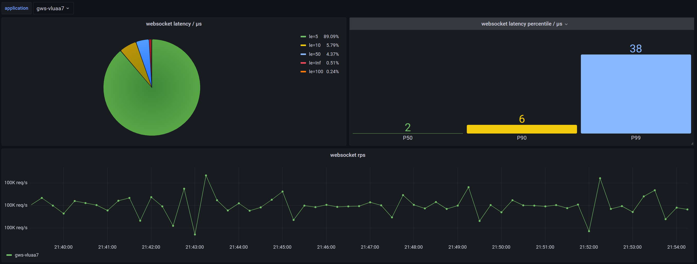
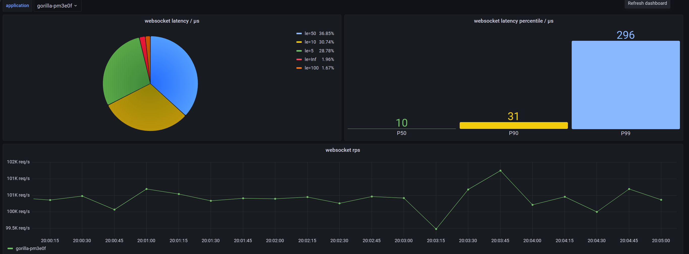

# gws

### event-driven go websocket server

[![Build Status][1]][2] [![MIT licensed][3]][4] [![Go Version][5]][6] [![codecov][7]][8] [![Go Report Card][9]][10]

[1]: https://github.com/lxzan/gws/workflows/Go%20Test/badge.svg?branch=master

[2]: https://github.com/lxzan/gws/actions?query=branch%3Amaster

[3]: https://img.shields.io/badge/license-MIT-blue.svg

[4]: LICENSE

[5]: https://img.shields.io/badge/go-%3E%3D1.16-30dff3?style=flat-square&logo=go

[6]: https://github.com/lxzan/gws

[7]: https://codecov.io/github/lxzan/gws/branch/master/graph/badge.svg?token=DJU7YXWN05

[8]: https://app.codecov.io/gh/lxzan/gws

[9]: https://goreportcard.com/badge/github.com/lxzan/gws

[10]: https://goreportcard.com/report/github.com/lxzan/gws

- [gws](#gws)
	- [Highlight](#highlight)
	- [Install](#install)
	- [Interface](#interface)
	- [Examples](#examples)
	- [Server](#server)
	- [Client](#client)
	- [TLS](#tls)
	- [Autobahn Test](#autobahn-test)
	- [Benchmark](#benchmark)
		- [IOPS](#iops)
		- [Latency](#latency)
		- [CPU](#cpu)
	- [Acknowledgments](#acknowledgments)

#### Highlight

- No dependency
- No channel, no additional resident concurrent goroutine
- Asynchronous non-blocking read and write support
- High IOPS and low latency
- Fully passes the WebSocket [autobahn-testsuite](https://github.com/crossbario/autobahn-testsuite)

#### Install

```bash
go get -v github.com/lxzan/gws@latest
```

#### Interface

```go
type Event interface {
	OnOpen(socket *Conn)
	OnError(socket *Conn, err error)
	OnClose(socket *Conn, code uint16, reason []byte)
	OnPing(socket *Conn, payload []byte)
	OnPong(socket *Conn, payload []byte)
	OnMessage(socket *Conn, message *Message)
}
```

#### Examples

- [chat room](examples/chatroom/main.go)
- [echo](examples/testsuite/main.go)

#### Server

```go
package main

import (
	"fmt"
	"github.com/lxzan/gws"
	"net/http"
)

func main() {
	var upgrader = gws.NewUpgrader(new(WebSocket), &gws.ServerOption{
		CompressEnabled:     true,
		CheckUtf8Enabled:    true,
		ReadMaxPayloadSize:  32 * 1024 * 1024,
		WriteMaxPayloadSize: 32 * 1024 * 1024,
		ReadAsyncEnabled:    true,
		ReadBufferSize:      4 * 1024,
		WriteBufferSize:     4 * 1024,
	})

	http.HandleFunc("/connect", func(writer http.ResponseWriter, request *http.Request) {
		socket, err := upgrader.Accept(writer, request)
		if err != nil {
			return
		}
		socket.Listen()
	})

	_ = http.ListenAndServe(":3000", nil)
}

type WebSocket struct{}

func (c *WebSocket) OnClose(socket *gws.Conn, code uint16, reason []byte) {
	fmt.Printf("onclose: code=%d, payload=%s\n", code, string(reason))
}

func (c *WebSocket) OnError(socket *gws.Conn, err error) {
	fmt.Printf("onerror: err=%s\n", err.Error())
}

func (c *WebSocket) OnOpen(socket *gws.Conn) {
	println("connected")
}

func (c *WebSocket) OnPing(socket *gws.Conn, payload []byte) {
	fmt.Printf("onping: payload=%s\n", string(payload))
	socket.WritePong(payload)
}

func (c *WebSocket) OnPong(socket *gws.Conn, payload []byte) {}

func (c *WebSocket) OnMessage(socket *gws.Conn, message *gws.Message) {
	defer message.Close()
	socket.WriteMessage(message.Opcode, message.Data.Bytes())
}
```

#### Client

```go
package main

import (
	"fmt"
	"github.com/lxzan/gws"
	"log"
)

func main() {
	socket, _, err := gws.NewClient(new(WebSocket), &gws.ClientOption{
		Addr: "ws://127.0.0.1:3000/connect",
	})
	if err != nil {
		log.Printf(err.Error())
		return
	}
	socket.Listen()
}

type WebSocket struct {
	gws.BuiltinEventHandler
}

func (c *WebSocket) OnMessage(socket *gws.Conn, message *gws.Message) {
	fmt.Printf("recv: %s\n", message.Data.String())
}
```

#### TLS

```go
package main

import (
	"github.com/gin-gonic/gin"
	"github.com/lxzan/gws"
)

func main() {
	app := gin.New()
	handler := new(WebSocket)
	upgrader := gws.NewUpgrader(handler, nil)
	app.GET("/connect", func(ctx *gin.Context) {
		socket, err := upgrader.Accept(ctx.Writer, ctx.Request)
		if err != nil {
			return
		}
		upgrader.Listen(socket)
	})
	cert := "server.crt"
	key := "server.key"
	if err := app.RunTLS(":8443", cert, key); err != nil {
		panic(err)
	}
}
```

#### Autobahn Test

```bash
cd examples/testsuite
mkdir reports
docker run -it --rm \
    -v ${PWD}/config:/config \
    -v ${PWD}/reports:/reports \
    crossbario/autobahn-testsuite \
    wstest -m fuzzingclient -s /config/fuzzingclient.json
```

#### Benchmark 

- Machine: `Ubuntu 20.04LTS VM (4C8T)`

##### IOPS

```
tcpkali -c 1000 --connect-rate 500 -r 1000 -T 300s -f assets/1K.txt --ws 127.0.0.1:${port}/connect
```


##### Latency

```
tcpkali -c 1000 --connect-rate 500 -r 100 -T 300s -f assets/1K.txt --ws 127.0.0.1:${port}/connect
```





##### CPU

```
  PID USER      PR  NI    VIRT    RES    SHR S  %CPU  %MEM     TIME+ COMMAND
26054 caster    20   0  720164  39320   7340 S 246.5   1.0  48:34.38 gorilla-linux-a
26059 caster    20   0  720852  53624   7196 S 179.4   1.3  48:39.85 gws-linux-amd64
```

#### Acknowledgments

The following project had particular influence on gws's design.

- [lesismal/nbio](https://github.com/lxzan/gws)
