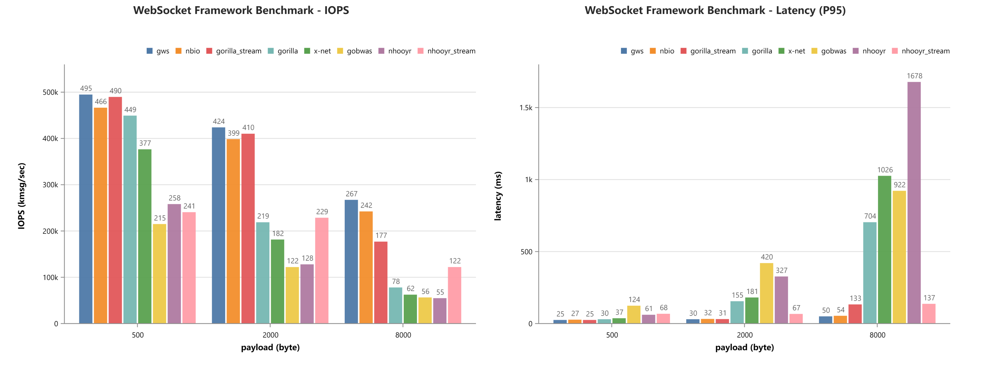

[中文](README_CN.md)

<div align="center">
	<h1>GWS</h1>
	
</div>

<h3 align="center">Simple · High Performance · Reliable WebSocket Server & Client Library</h3>

<div align="center">

[](https://github.com/avelino/awesome-go#networking)
[](https://codecov.io/gh/lxzan/gws)
[](https://github.com/lxzan/gws/actions/workflows/go.yml)
[](https://goreportcard.com/report/github.com/lxzan/gws)
[](https://hellogithub.com/repository/268cee8eb54b4a7189d38fb12f165177)
[](LICENSE)
[](https://github.com/lxzan/gws)
[](https://deepwiki.com/lxzan/gws)

</div>

### Introduction

GWS (Go WebSocket) is a **simple, high‑performance and feature‑complete** WebSocket library written in Go.
It is designed for **high‑concurrency** scenarios and is ideal for building **API gateways, long‑lived connection hubs, reverse proxies, IM / chat, online games, real‑time streaming, and push / subscribe systems**.
GWS exposes an extremely **minimal, event‑driven API**, so you can build a stable WebSocket server or client with very little code.

GWS is built on an event‑driven model: every connection has its own goroutine to drive the event loop, and events can be processed in a non‑blocking way.

### Why GWS

- <font size=3>Simplicity & Developer Experience</font>
    - **Event‑driven & intuitive**: The `Event` interface (`OnOpen / OnMessage / OnClose / OnPing / OnPong`) mirrors how you think about WebSocket lifecycles.
    - **High coding efficiency**: Protocol details are hidden behind a small, clear API, so you can focus almost entirely on business logic.

- <font size=3>High Performance</font>
    - **High throughput & low latency**: Carefully tuned for WebSocket workloads such as echo servers and long‑lived push streams, making it a great fit for latency‑sensitive applications.
    - **Low memory footprint**: Aggressive buffer reuse and compression strategies significantly reduce memory and CPU cost under heavy concurrency.

- <font size=3>Reliability & Standards Compliance</font>
    - **Robust error handling**: Clear, well‑defined behaviors for connection errors, protocol violations, compression failures, etc.
    - **Battle‑tested**: Passes all `Autobahn` test cases and is compliant with `RFC 6455` / `RFC 7692`. Unit tests cover almost all conditional branches.

### Benchmark

#### IOPS (Echo Server)

GOMAXPROCS=4, Connection=1000, CompressEnabled=false



#### GoBench

```go
go test -benchmem -run=^$ -bench . github.com/lxzan/gws
goos: linux
goarch: amd64
pkg: github.com/lxzan/gws
cpu: AMD Ryzen 5 PRO 4650G with Radeon Graphics
BenchmarkConn_WriteMessage/compress_disabled-12                  5263632               232.3 ns/op            24 B/op          1 allocs/op
BenchmarkConn_WriteMessage/compress_enabled-12                     99663             11265 ns/op             386 B/op          1 allocs/op
BenchmarkConn_ReadMessage/compress_disabled-12                   7809654               152.4 ns/op             8 B/op          0 allocs/op
BenchmarkConn_ReadMessage/compress_enabled-12                     326257              3133 ns/op              81 B/op          1 allocs/op
PASS
ok      github.com/lxzan/gws    17.231s
```

### Index

- [Introduction](#introduction)
- [Why GWS](#why-gws)
- [Benchmark](#benchmark)
- [Index](#index)
- [Feature](#feature)
- [Attention](#attention)
- [Install](#install)
- [Event](#event)
- [Quick Start](#quick-start)
- [Best Practice](#best-practice)
- [More Examples](#more-examples)
- [Autobahn Test](#autobahn-test)
- [Ecosystem](#ecosystem)
- [Communication](#communication)
- [Buy me a coffee](#buy-me-a-coffee)
- [Acknowledgments](#acknowledgments)

### Feature

- [x] **Event‑driven API** based on the `Event` interface, similar to common WebSocket SDKs.
- [x] **Broadcast support** via `Broadcaster`, which reuses compressed frames for efficient fan‑out.
- [x] **Dial via proxy** using a customizable `Dialer` (e.g. SOCKS5 / HTTP proxy).
- [x] **Context‑takeover (permessage‑deflate)** with configurable sliding window sizes.
- [x] **Segmented writing of large files** with `WriteFile` to reduce peak memory during large transfers.
- [x] **Concurrent & asynchronous non‑blocking write** with built‑in task queues and `Writev` / `WritevAsync`.
- [x] **Strong standards compatibility**, passing all Autobahn test cases
      [Server report](https://lxzan.github.io/gws/reports/servers/) / [Client report](https://lxzan.github.io/gws/reports/clients/)

### Attention

- For most business use‑cases, errors returned by exported methods on `gws.Conn` can be treated as **informational**: the library has already taken appropriate action internally (e.g. closing the connection, emitting events).
- When transferring **very large files**, a single connection may occupy bandwidth and I/O for a long time; you may want throttling, sharding or other flow‑control at the business layer.
- If you reuse `net/http` (e.g. call `Upgrade` inside an HTTP handler), always call `ReadLoop` inside a **separate goroutine**, otherwise blocking will prevent the request context from being garbage‑collected in time.

### Install

```bash
go get -v github.com/lxzan/gws@latest
```

### Event

```go
type Event interface {
    OnOpen(socket *Conn)                        // connection is established
    OnClose(socket *Conn, err error)            // received a close frame or input/output error occurs
    OnPing(socket *Conn, payload []byte)        // received a ping frame
    OnPong(socket *Conn, payload []byte)        // received a pong frame
    OnMessage(socket *Conn, message *Message)   // received a text/binary frame
}
```

### Quick Start

```go
package main

import "github.com/lxzan/gws"

func main() {
	gws.NewServer(&gws.BuiltinEventHandler{}, nil).Run(":6666")
}
```

### Best Practice

```go
package main

import (
	"github.com/lxzan/gws"
	"net/http"
	"time"
)

const (
	PingInterval = 5 * time.Second
	PingWait     = 10 * time.Second
)

func main() {
	upgrader := gws.NewUpgrader(&Handler{}, &gws.ServerOption{
		ParallelEnabled:  true,                                 // Parallel message processing
		Recovery:          gws.Recovery,                         // Exception recovery
		PermessageDeflate: gws.PermessageDeflate{Enabled: true}, // Enable compression
	})
	http.HandleFunc("/connect", func(writer http.ResponseWriter, request *http.Request) {
		socket, err := upgrader.Upgrade(writer, request)
		if err != nil {
			return
		}
		go func() {
			socket.ReadLoop() // Blocking prevents the context from being GC.
		}()
	})
	http.ListenAndServe(":6666", nil)
}

type Handler struct{}

func (c *Handler) OnOpen(socket *gws.Conn) {
	_ = socket.SetDeadline(time.Now().Add(PingInterval + PingWait))
}

func (c *Handler) OnClose(socket *gws.Conn, err error) {}

func (c *Handler) OnPing(socket *gws.Conn, payload []byte) {
	_ = socket.SetDeadline(time.Now().Add(PingInterval + PingWait))
	_ = socket.WritePong(nil)
}

func (c *Handler) OnPong(socket *gws.Conn, payload []byte) {}

func (c *Handler) OnMessage(socket *gws.Conn, message *gws.Message) {
	defer message.Close()
	socket.WriteMessage(message.Opcode, message.Bytes())
}

```

### More Examples

#### KCP

- server

```go
package main

import (
	"log"
	"github.com/lxzan/gws"
	kcp "github.com/xtaci/kcp-go"
)

func main() {
	listener, err := kcp.Listen(":6666")
	if err != nil {
		log.Println(err.Error())
		return
	}
	app := gws.NewServer(&gws.BuiltinEventHandler{}, nil)
	app.RunListener(listener)
}
```

- client

```go
package main

import (
	"github.com/lxzan/gws"
	kcp "github.com/xtaci/kcp-go"
	"log"
)

func main() {
	conn, err := kcp.Dial("127.0.0.1:6666")
	if err != nil {
		log.Println(err.Error())
		return
	}
	app, _, err := gws.NewClientFromConn(&gws.BuiltinEventHandler{}, nil, conn)
	if err != nil {
		log.Println(err.Error())
		return
	}
	app.ReadLoop()
}

```

#### Proxy

Dial via proxy, using socks5 protocol.

```go
package main

import (
	"crypto/tls"
	"github.com/lxzan/gws"
	"golang.org/x/net/proxy"
	"log"
)

func main() {
	socket, _, err := gws.NewClient(new(gws.BuiltinEventHandler), &gws.ClientOption{
		Addr:      "wss://example.com/connect",
		TlsConfig: &tls.Config{InsecureSkipVerify: true},
		NewDialer: func() (gws.Dialer, error) {
			return proxy.SOCKS5("tcp", "127.0.0.1:1080", nil, nil)
		},
		PermessageDeflate: gws.PermessageDeflate{
			Enabled:               true,
			ServerContextTakeover: true,
			ClientContextTakeover: true,
		},
	})
	if err != nil {
		log.Println(err.Error())
		return
	}
	socket.ReadLoop()
}

```

#### Broadcast

Create a Broadcaster instance, call the Broadcast method in a loop to send messages to each client, and close the
broadcaster to reclaim memory. The message is compressed only once.

```go
func Broadcast(conns []*gws.Conn, opcode gws.Opcode, payload []byte) {
    var b = gws.NewBroadcaster(opcode, payload)
    defer b.Close()
    for _, item := range conns {
        _ = b.Broadcast(item)
    }
}
```

#### WriteWithTimeout

`SetDeadline` covers most of the scenarios, but if you want to control the timeout for each write, you need to
encapsulate the `WriteWithTimeout` function, the creation and destruction of the `timer` will incur some overhead.

```go
func WriteWithTimeout(socket *gws.Conn, p []byte, timeout time.Duration) error {
	var sig = atomic.Uint32{}
	var timer = time.AfterFunc(timeout, func() {
		if sig.CompareAndSwap(0, 1) {
			socket.WriteClose(1000, []byte("write timeout"))
		}
	})
	var err = socket.WriteMessage(gws.OpcodeText, p)
	if sig.CompareAndSwap(0, 1) {
		timer.Stop()
	}
	return err
}
```

#### Pub / Sub

Use the event_emitter package to implement the publish-subscribe model. Wrap `gws.Conn` in a structure and implement the
GetSubscriberID method to get the subscription ID, which must be unique. The subscription ID is used to identify the
subscriber, who can only receive messages on the subject of his subscription.

This example is useful for building chat rooms or push messages using gws. This means that a user can subscribe to one
or more topics via websocket, and when a message is posted to that topic, all subscribers will receive the message.

```go
package main

import (
    "github.com/lxzan/event_emitter"
    "github.com/lxzan/gws"
)

type Subscriber gws.Conn

func NewSubscriber(conn *gws.Conn) *Subscriber { return (*Subscriber)(conn) }

func (c *Subscriber) GetSubscriberID() int64 {
    userId, _ := c.GetMetadata().Load("userId")
    return userId.(int64)
}

func (c *Subscriber) GetMetadata() event_emitter.Metadata { return c.Conn().Session() }

func (c *Subscriber) Conn() *gws.Conn { return (*gws.Conn)(c) }

func Subscribe(em *event_emitter.EventEmitter[int64, *Subscriber], s *Subscriber, topic string) {
    em.Subscribe(s, topic, func(msg any) {
        _ = msg.(*gws.Broadcaster).Broadcast(s.Conn())
    })
}

func Publish(em *event_emitter.EventEmitter[int64, *Subscriber], topic string, msg []byte) {
    var broadcaster = gws.NewBroadcaster(gws.OpcodeText, msg)
    defer broadcaster.Close()
    em.Publish(topic, broadcaster)
}
```

### Autobahn Test

```bash
cd examples/autobahn
mkdir reports
docker run -it --rm \
    -v ${PWD}/config:/config \
    -v ${PWD}/reports:/reports \
    crossbario/autobahn-testsuite \
    wstest -m fuzzingclient -s /config/fuzzingclient.json
```

### Ecosystem

- [proxy-connect-dialer-go](https://github.com/elastic/proxy-connect-dialer-go) - Custom dialer that sends headers to the proxy server during CONNECT requests.

### Communication

> 微信需要先添加好友再拉群, 请注明来自 GitHub

<div>

<span>&nbsp;&nbsp;&nbsp;&nbsp;</span>

</div>

### Buy me a coffee


### Acknowledgments

The following project had particular influence on gws's design.

- [crossbario/autobahn-testsuite](https://github.com/crossbario/autobahn-testsuite)
- [klauspost/compress](https://github.com/klauspost/compress)
- [lesismal/nbio](https://github.com/lesismal/nbio)
