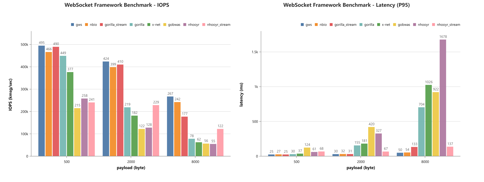

<div align="center">
	<h1>GWS</h1>
	
</div>

<h3 align="center">简单, 快速, 可靠的 WebSocket 服务器和客户端</h3>

<div align="center">

[](https://github.com/avelino/awesome-go#networking)
[](https://codecov.io/gh/lxzan/gws)
[](https://github.com/lxzan/gws/actions/workflows/go.yml)
[](https://goreportcard.com/report/github.com/lxzan/gws)
[](https://hellogithub.com/repository/268cee8eb54b4a7189d38fb12f165177)
[](LICENSE)
[](https://github.com/lxzan/gws)

</div>

### 介绍

GWS（Go WebSocket）是一个用 Go 编写的非常简单、快速、可靠且功能丰富的 WebSocket 实现。它设计用于高并发环境，构建"接口", "代理", "游戏", "流媒体", "消息发布订阅"等服务。它提供非常简单的 API,
您可以轻松编写自己的服务器或客户端。

### 为什么选择 GWS

- <font size=3>简单易用</font>

  - **用户友好**: 简洁明了的 `WebSocket` 事件接口设计，让服务器和客户端的交互变得轻松简单.
  - **编码效率**: 最大限度地减少实施复杂的解决方案所需的代码量.

- <font size=3>性能出众</font>

  - **高吞吐低延迟**: 专为快速传输和接收数据而设计，是时间敏感型应用的理想之选.
  - **低内存占用**: 高度优化的内存复用系统, 最大限度降低内存使用量，降低您的成本.

- <font size=3>稳定可靠</font>
  - **健壮的错误处理**: 管理和减少错误的先进机制，确保持续运行.
  - **完善的测试用例**: 通过了所有 `Autobahn` 测试用例, 符合 `RFC 7692` 标准. 单元测试覆盖率几乎达到 100%, 覆盖所有条件分支.

### 基准测试

#### IOPS (Echo Server)

GOMAXPROCS=4, Connection=1000, CompressEnabled=false



#### GoBench

```go
go test -benchmem -run=^$ -bench . github.com/lxzan/gws
goos: linux
goarch: amd64
pkg: github.com/lxzan/gws
cpu: AMD Ryzen 5 PRO 4650G with Radeon Graphics
BenchmarkConn_WriteMessage/compress_disabled-12                  5263632               232.3 ns/op            24 B/op          1 allocs/op
BenchmarkConn_WriteMessage/compress_enabled-12                     99663             11265 ns/op             386 B/op          1 allocs/op
BenchmarkConn_ReadMessage/compress_disabled-12                   7809654               152.4 ns/op             8 B/op          0 allocs/op
BenchmarkConn_ReadMessage/compress_enabled-12                     326257              3133 ns/op              81 B/op          1 allocs/op
PASS
ok      github.com/lxzan/gws    17.231s
```

### Index

- [介绍](#介绍)
- [为什么选择 GWS](#为什么选择-gws)
- [基准测试](#基准测试)
	- [IOPS (Echo Server)](#iops-echo-server)
	- [GoBench](#gobench)
- [Index](#index)
- [特性](#特性)
- [注意](#注意)
- [安装](#安装)
- [事件](#事件)
- [快速上手](#快速上手)
- [最佳实践](#最佳实践)
- [更多用例](#更多用例)
	- [KCP](#kcp)
	- [代理](#代理)
	- [广播](#广播)
	- [写入超时](#写入超时)
	- [发布/订阅](#发布订阅)
- [Autobahn 测试](#autobahn-测试)
- [交流](#交流)
- [赞赏](#赞赏)
- [致谢](#致谢)

### 特性

- [x] 事件驱动式 API
- [x] 广播
- [x] 代理拨号
- [x] 上下文接管 
- [x] 大文件分段写入
- [x] 支持并发和异步非阻塞写入
- [x] 通过所有 Autobahn 测试用例 [Server](https://lxzan.github.io/gws/reports/servers/) / [Client](https://lxzan.github.io/gws/reports/clients/)

### 注意

- 所有 gws.Conn 导出方法返回的错误都是可忽略的, 它们在内部已经被妥善处理了
- 传输大文件有阻塞连接的风险
- 如果复用 HTTP 服务器, 建议开启新的 Goroutine 来调用 ReadLoop, 以避免请求上下文内存不能及时回收.

### 安装

```bash
go get -v github.com/lxzan/gws@latest
```

### 事件

```go
type Event interface {
    OnOpen(socket *Conn)                        // connection is established
    OnClose(socket *Conn, err error)            // received a close frame or input/output error occurs
    OnPing(socket *Conn, payload []byte)        // received a ping frame
    OnPong(socket *Conn, payload []byte)        // received a pong frame
    OnMessage(socket *Conn, message *Message)   // received a text/binary frame
}
```

### 快速上手

```go
package main

import "github.com/lxzan/gws"

func main() {
	gws.NewServer(&gws.BuiltinEventHandler{}, nil).Run(":6666")
}
```

### 最佳实践

```go
package main

import (
	"net/http"
	"time"

	"github.com/lxzan/gws"
)

const (
	PingInterval = 5 * time.Second
	PingWait     = 10 * time.Second
)

func main() {
	upgrader := gws.NewUpgrader(&Handler{}, &gws.ServerOption{
		ParallelEnabled:  true,                                 // 开启并行消息处理
		Recovery:          gws.Recovery,                         // 开启异常恢复
		PermessageDeflate: gws.PermessageDeflate{Enabled: true}, // 开启压缩
	})
	http.HandleFunc("/connect", func(writer http.ResponseWriter, request *http.Request) {
		socket, err := upgrader.Upgrade(writer, request)
		if err != nil {
			return
		}
		go func() {
			socket.ReadLoop() // 此处阻塞会使请求上下文不能顺利被GC
		}()
	})
	http.ListenAndServe(":6666", nil)
}

type Handler struct{}

func (c *Handler) OnOpen(socket *gws.Conn) {
	_ = socket.SetDeadline(time.Now().Add(PingInterval + PingWait))
}

func (c *Handler) OnClose(socket *gws.Conn, err error) {}

func (c *Handler) OnPing(socket *gws.Conn, payload []byte) {
	_ = socket.SetDeadline(time.Now().Add(PingInterval + PingWait))
	_ = socket.WritePong(nil)
}

func (c *Handler) OnPong(socket *gws.Conn, payload []byte) {}

func (c *Handler) OnMessage(socket *gws.Conn, message *gws.Message) {
	defer message.Close()
	socket.WriteMessage(message.Opcode, message.Bytes())
}
```

### 更多用例

#### KCP

- server

```go
package main

import (
	"log"
	"github.com/lxzan/gws"
	kcp "github.com/xtaci/kcp-go"
)

func main() {
	listener, err := kcp.Listen(":6666")
	if err != nil {
		log.Println(err.Error())
		return
	}
	app := gws.NewServer(&gws.BuiltinEventHandler{}, nil)
	app.RunListener(listener)
}
```

- client

```go
package main

import (
	"github.com/lxzan/gws"
	kcp "github.com/xtaci/kcp-go"
	"log"
)

func main() {
	conn, err := kcp.Dial("127.0.0.1:6666")
	if err != nil {
		log.Println(err.Error())
		return
	}
	app, _, err := gws.NewClientFromConn(&gws.BuiltinEventHandler{}, nil, conn)
	if err != nil {
		log.Println(err.Error())
		return
	}
	app.ReadLoop()
}

```

#### 代理

通过代理拨号, 使用 socks5 协议.

```go
package main

import (
	"crypto/tls"
	"github.com/lxzan/gws"
	"golang.org/x/net/proxy"
	"log"
)

func main() {
	socket, _, err := gws.NewClient(new(gws.BuiltinEventHandler), &gws.ClientOption{
		Addr:      "wss://example.com/connect",
		TlsConfig: &tls.Config{InsecureSkipVerify: true},
		NewDialer: func() (gws.Dialer, error) {
			return proxy.SOCKS5("tcp", "127.0.0.1:1080", nil, nil)
		},
		PermessageDeflate: gws.PermessageDeflate{
			Enabled:               true,
			ServerContextTakeover: true,
			ClientContextTakeover: true,
		},
	})
	if err != nil {
		log.Println(err.Error())
		return
	}
	socket.ReadLoop()
}

```

#### 广播

先创建一个 Broadcaster 实例，然后在循环中调用 Broadcast 方法向每个客户端发送消息，最后关闭
广播程序以回收内存。整个过程中消息只会被压缩一次。

```go
func Broadcast(conns []*gws.Conn, opcode gws.Opcode, payload []byte) {
    var b = gws.NewBroadcaster(opcode, payload)
    defer b.Close()
    for _, item := range conns {
        _ = b.Broadcast(item)
    }
}
```

#### 写入超时

`SetDeadline` 可以覆盖大部分使用场景, 想要精细地控制每一次写入的超时时间, 则需要自行封装下 `WriteWithTimeout`
函数, `timer` 的创建和销毁会有一定额外开销.

```go
func WriteWithTimeout(socket *gws.Conn, p []byte, timeout time.Duration) error {
	var sig = atomic.Uint32{}
	var timer = time.AfterFunc(timeout, func() {
		if sig.CompareAndSwap(0, 1) {
			socket.WriteClose(1000, []byte("write timeout"))
		}
	})
	var err = socket.WriteMessage(gws.OpcodeText, p)
	if sig.CompareAndSwap(0, 1) {
		timer.Stop()
	}
	return err
}
```

#### 发布/订阅

使用 event_emitter 包实现发布订阅模式。用结构体包装 `gws.Conn`，并实现 GetSubscriberID 方法以获取订阅 ID，该 ID 必须是唯一的。订阅 ID 用于识别订阅者，订阅者只能接收其订阅主题的消息。

此示例对于使用 gws 构建聊天室或消息推送非常有用。这意味着用户可以通过 websocket 订阅一个或多个主题，当向该主题发布消息时，所有订阅用户都会收到消息。

```go
package main

import (
    "github.com/lxzan/event_emitter"
    "github.com/lxzan/gws"
)

type Subscriber gws.Conn

func NewSubscriber(conn *gws.Conn) *Subscriber { return (*Subscriber)(conn) }

func (c *Subscriber) GetSubscriberID() int64 {
    userId, _ := c.GetMetadata().Load("userId")
    return userId.(int64)
}

func (c *Subscriber) GetMetadata() event_emitter.Metadata { return c.Conn().Session() }

func (c *Subscriber) Conn() *gws.Conn { return (*gws.Conn)(c) }

func Subscribe(em *event_emitter.EventEmitter[int64, *Subscriber], s *Subscriber, topic string) {
    em.Subscribe(s, topic, func(msg any) {
        _ = msg.(*gws.Broadcaster).Broadcast(s.Conn())
    })
}

func Publish(em *event_emitter.EventEmitter[int64, *Subscriber], topic string, msg []byte) {
    var broadcaster = gws.NewBroadcaster(gws.OpcodeText, msg)
    defer broadcaster.Close()
    em.Publish(topic, broadcaster)
}
```

### Autobahn 测试

```bash
cd examples/autobahn
mkdir reports
docker run -it --rm \
    -v ${PWD}/config:/config \
    -v ${PWD}/reports:/reports \
    crossbario/autobahn-testsuite \
    wstest -m fuzzingclient -s /config/fuzzingclient.json
```

### 交流

> 微信需要先添加好友再拉群, 请注明来自 GitHub

<div>

<span>&nbsp;&nbsp;&nbsp;&nbsp;</span>

</div>

### 赞赏


### 致谢

- [crossbario/autobahn-testsuite](https://github.com/crossbario/autobahn-testsuite)
- [klauspost/compress](https://github.com/klauspost/compress)
- [lesismal/nbio](https://github.com/lesismal/nbio)
